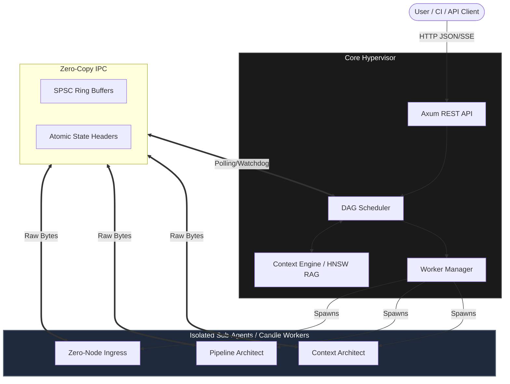

<div align="center">
  <h1>🌌 Eva Hypervisor</h1>
  <p><strong>A Zero-Trust, Air-Gapped LLM Orchestration Framework built in Pure Rust</strong></p>

  <p>
    <a href="https://github.com/BadRabbit00/Eva-Project/actions"></a>
    <a href="https://www.rust-lang.org/"></a>
    <a href="https://nixos.org/"></a>
    <a href="https://github.com/huggingface/candle"></a>
  </p>
</div>

<br/>

**Eva Hypervisor** is an enterprise-grade, ultra-low-latency orchestration framework for local LLMs. It discards heavy HTTP overhead between agents in favor of **Zero-Copy Shared Memory (IPC)** and orchestrates complex logic via a multi-agent DAG (Directed Acyclic Graph) architecture.

It is designed for environments where **absolute privacy, security, and hardware efficiency** are non-negotiable.

---

## ⚡ Core Architecture

Eva acts as a "Hypervisor" for AI workloads, spinning up specialized isolated worker processes (Sub-Agents) and bridging them together using lock-free rings and shared memory.



## 🔥 Key Features

- 🛡️ **Hermetic Air-Gapped Execution:** No external API calls. All inferences run locally.
- 🚀 **Zero-Copy IPC:** Cross-process communication uses strict memory offsets (`#[repr(C)]`) and Lock-free Single-Producer Single-Consumer (SPSC) Ring Buffers. (Note: Large dynamic outputs are allocated via ephemeral shared memory segments, NOT raw file paths, to preserve absolute FS isolation).
- 🧠 **Pure Rust Inference:** Powered by [HuggingFace Candle](https://github.com/huggingface/candle). No Python footprint, zero GIL lock, immediate startup.
- 🕸️ **Context Engine & RAG:** Built-in HNSW vector index (`hnsw_rs`) for extreme performance local semantic retrieval.
- ⏱️ **Hard Real-Time Scheduling:** Custom WSJF (Weighted Shortest Job First) DAG scheduling and EMA (Exponential Moving Average) metric tracking.
- 🛠️ **MCP Ready & Secure:** Scans `.md` manual files dynamically. Raw shell interactions and MCP tool executions are tightly jailed using **Bubblewrap (bwrap)** or **Firecracker microVMs** to prevent AI-generated RCE.

---

## 📂 Project Layout

| Directory | Description |
|---|---|
| `/core` | The **Hypervisor**. Contains the API, DAG Scheduler, Context Engine, and Worker Manager. |
| `/shared-ipc` | The **Nervous System**. Low-level, strictly aligned C-compatible memory maps and IPC protocols. |
| `/worker-candle` | The **Muscle**. Isolated, pure-Rust binary that loads `.safetensors` and runs generation. |
| `/scripts` | Automations, including `download_models.sh` for pulling strictly required weights. |

---

## 🚀 Getting Started

### 1. Environment Setup

This project uses `nix` to guarantee perfectly reproducible development environments.

```bash
# Enter the nix shell (installs Rust, Cargo, huggingface-cli, etc.)
nix develop
```

### 2. Download Model Weights

Models are pulled into your local isolated storage (`~/.eva/models`). You must be authenticated with HuggingFace.

```bash
# Provide HF Token if you haven't yet
hf auth login

# Run the automated fetch script
./scripts/download_models.sh
```

### 3. Build & Run

Eva is compiled aggressively for your local target. 

```bash
# Build the workspace
cargo build --release

# The hypervisor will automatically spawn the required worker-candle instances
cargo run --release -p core
```

---

## ⚙️ Configuration

The Hypervisor behavior is controlled by `~/.config/eva/daemon.toml`. If missing, default values are synthesized:

```toml
port = 3000
shmem_size_mb = 16
models_dir = "~/.eva/models"
```

## 📜 Philosophy

> *Code without types is chaos. A system without strict memory borders is a vulnerability waiting to happen.*

Eva is built for **Engineers**. Memory alignment is manual. Panics are treated as catastrophic system failures. Every error is logged and traced. This is not a wrapper around an API; this is a foundational engine for autonomous operations.

---
<div align="center">
  <p>Built with ❤️ and paranoia.</p>
</div>
